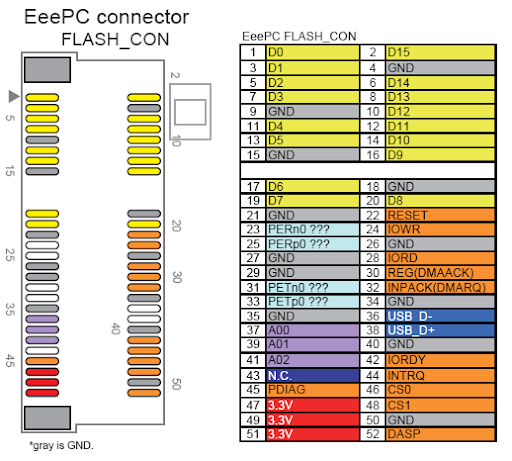

# PCIE_Arduino [· 中文版](README/READMEcn.md)

Arduino on PCIE (not miniPCIE). Achieved by PCIE → RS232/USB → TTL → ATMEGA328P.

Alpha testing, will be update quiet soon.

# A similar project

[Q] What's the difference between [moonpunchorg/pcieduino](https://github.com/moonpunchorg/pcieduino)?
---
[A] Mini-PCIe incorporates USB, while the PCIe does not.
---

As the picture shows, mini-PCIE's 36 & 38 pin is USB! The usb control ic is on the mutherboaed.
Instead, PCIE doesn't has this two pin.

For those PCIE to mini-PCIE adapter card, if it wants to maintain the usb function, it will have a external usb cable. At least for me, I haven't saw a usb chip adapt design yet. The reason is obvious, it is not worth to do that.

But as a diy project, I whould like to have a highly integrated design no matter the cost. I want to integration my arduino on a PCIE card and connect with my computer as usual, so I can use this base to make more cool things. Such as a RGB controller. Also this is a good chance for me to practice how to design high speed pcb.

