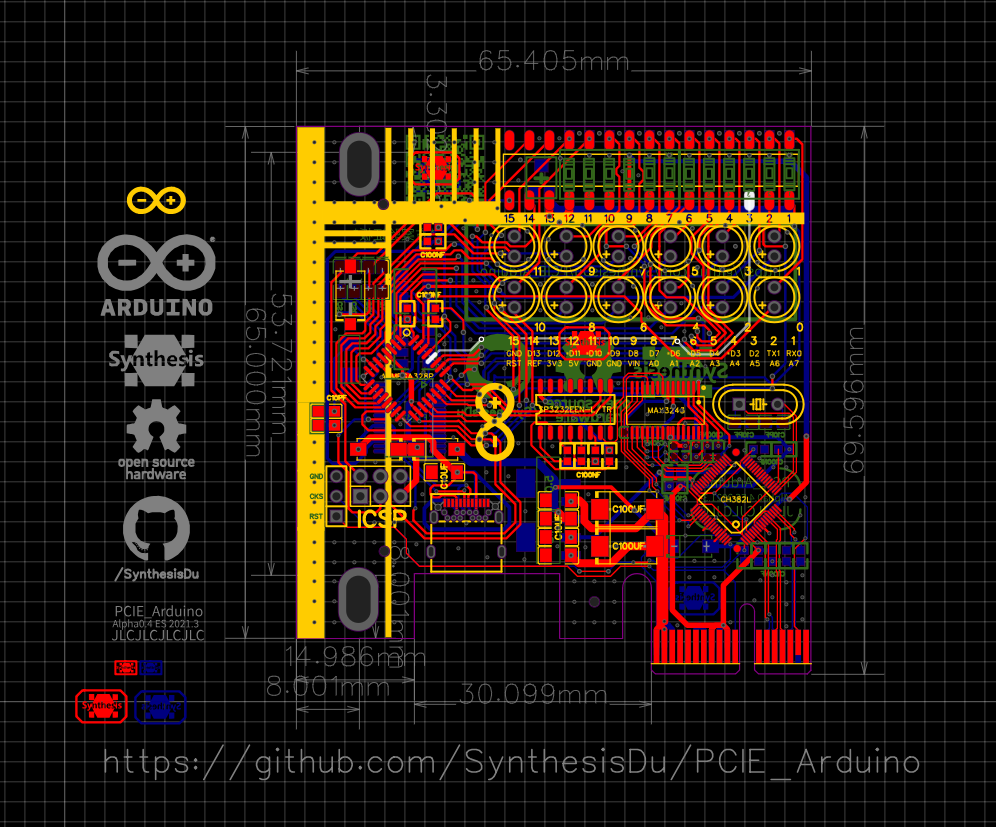

# PCIE_Arduino 
* [中文版](README/READMEcn.md)

Arduino on PCIE (not miniPCIE). Achieved by PCIE → RS232 → TTL → ATMEGA328P.
Alpha testing, will be update quiet soon.

[Q] What's the difference between [moonpunchorg/pcieduino](https://github.com/moonpunchorg/pcieduino)?
---
[A] PCIE is quit different between mini-PCIE with arduino connect.
---

As the picture shows, mini-PCIE's 36 & 38 pin is USB! The usb control ic is on the mutherboaed.
Instead, PCIE doesn't has this two pin.

For those PCIE to mini-PCIE adapter card, if it wants to maintain the usb function, it will have a external usb cable. At least for me, I haven't saw a usb chip adapt design yet. The reason is obvious, it is not worth to do that.

But as a diy project, I whould like to have a highly integrated design no matter the cost. I want to integration my arduino on a PCIE card and connect with my computer as usual, so I can use this base to make more cool things. Such as a RGB controller. Also this is a good chance for me to practice how to design high speed pcb.

[Q] Why choose RS-232 chip instead of USB?
---
[A] It is hard to buy a first hand USB host chip.
---
I am in ShenZhen, China. Here has one of the electronic marketplace that has most abundant kind of ic in the world. But I still can't find a retail outlet usb ic. I can only find the only retailing RS-232 chip that I use in Alpha0.1 version (this chip even needs a special driver) . However I may try other usb chip that more common with second hand if this RS-232 chip not up to expectations.