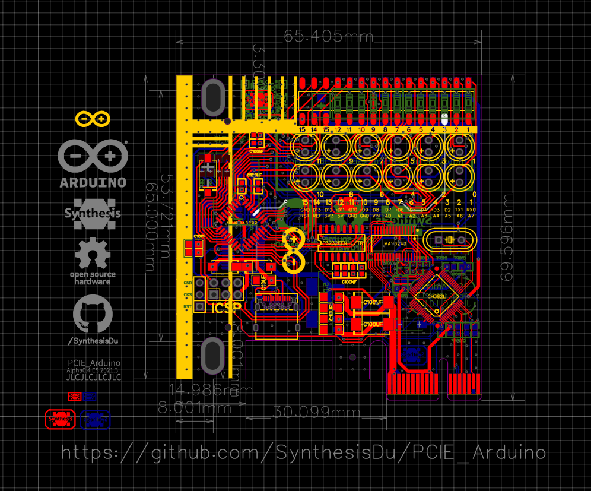
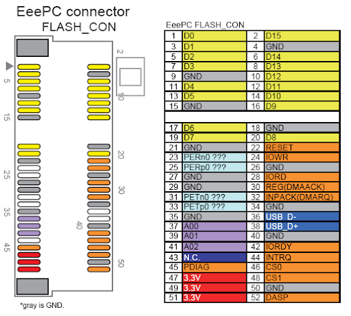
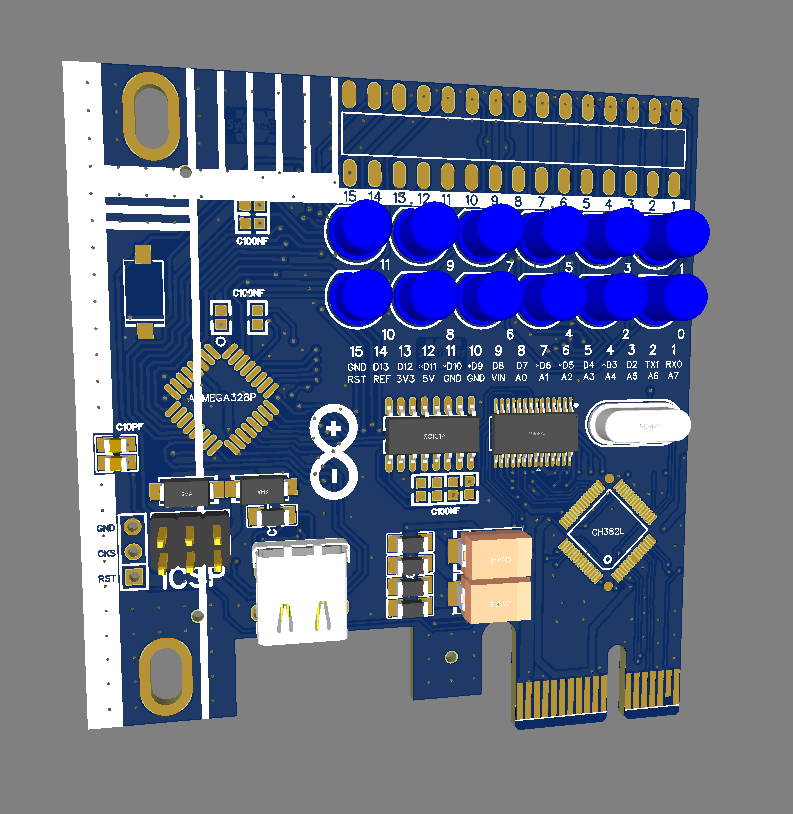
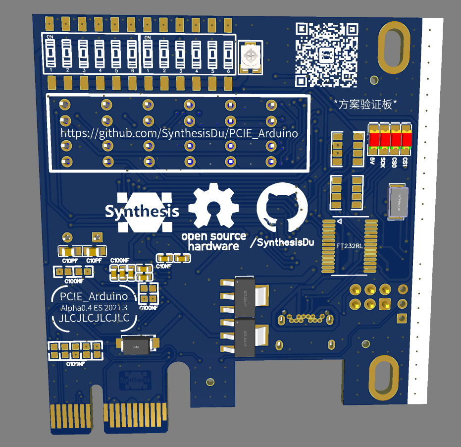

# PCIE_Arduino 
# [· English](../README.md)

集成在PCIE卡上的Arduino。实现方式为PCIE → RS232 → TTL → ATMEGA328P。

还在A测中。。。。。。

[问] 这和 [moonpunchorg/pcieduino](https://github.com/moonpunchorg/pcieduino)这个项目有什么区别?
---
[答] 区别在于mini-PCIE自带usb，而PCIE没有。
---

如图所示,mini-PCIE的36和38脚其实就是usb。这个usb的控制芯片在主板上。
而PCIE并没有这两个usb引脚。

对于市面上能买到的PCIE转mini-PCIE卡，它们都会有一个外接主板9针usb口的线用来在需要时提供usb通道。我们见不到集成usb控制器的转接卡，只有这种外接的方案，原因其实是集成usb芯片毫无性价比可言。

不过对我来说，作为自己设计的项目，就不用在乎成本了。高集成度的优雅是最重要的。同时把Arduino集成在PCIE上之后我还有很多进一步的设计想法。比如制作PCIE槽位的RGB控制器。并且因为有usb与电脑通讯，这些功能都可以开发相应的软件。以及我正好在用这个项目学习高速pcb的设计。

[问] 为什么使用RS-232桥而不是usb桥？
---
[答] 很难买到零售的PCIE转usb主控。
---
尽管我就住在深圳华强北附近，我还是没找到零售的usb主控。只有这一个在Alpha0.1版本中应用的RS-232主控有零售的（这东西还不是免驱的就很烦）。如果这个芯片的效果不佳，后续可能会设计能买到的二手usb控制器的版本。

